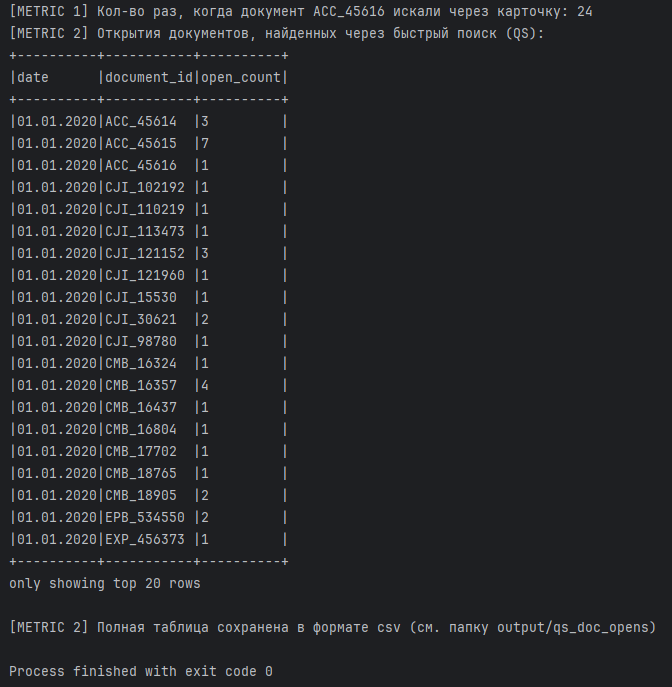
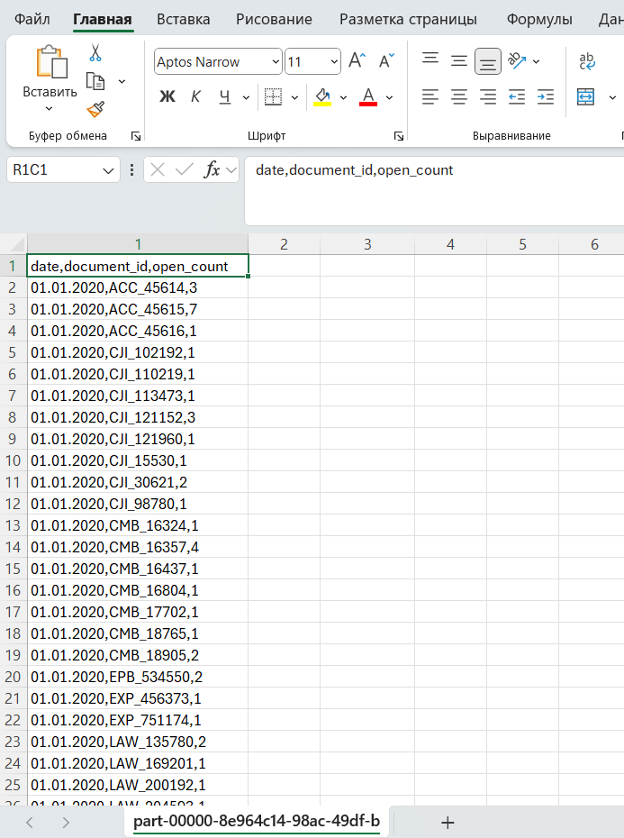

## 🚀 Как использовать

1️⃣ Положить все обрабатываемые логи в папку  
   `src/main/resources/logs/`

2️⃣ Запустить `Main.scala`

3️⃣ Что получится в результате:

- В консоль выведется:
    - **METRIC 1** — количество раз, когда документ `ACC_45616` был найден через карточку поиска
    - **METRIC 2** — сводная таблица открытий документов, найденных через быстрый поиск, по дням (выводятся первые 20 строк)

- **METRIC 2** дополнительно сохраняется в формате CSV в папку `output/qs_doc_opens/`

📌 В консоль выводятся только итоговые данные (логи уровня `INFO` скрыты для удобства чтения)

## 🚀 Полученные результаты

**Вывод в консоль:**

**Сохраненный CSV-файл:**

---

**P.S.** Попытался правда вникнуть в Spark и надеюсь, что код получился в целом эффективным и аккуратным 🙂